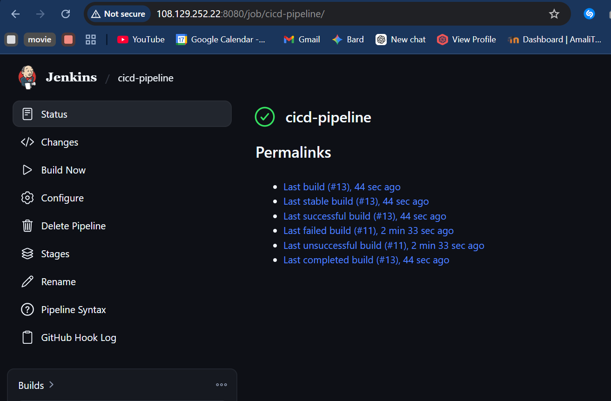
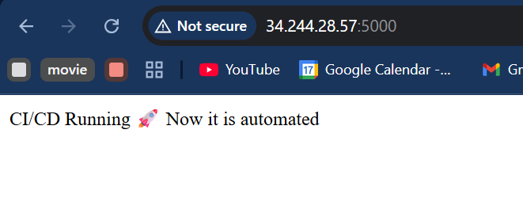
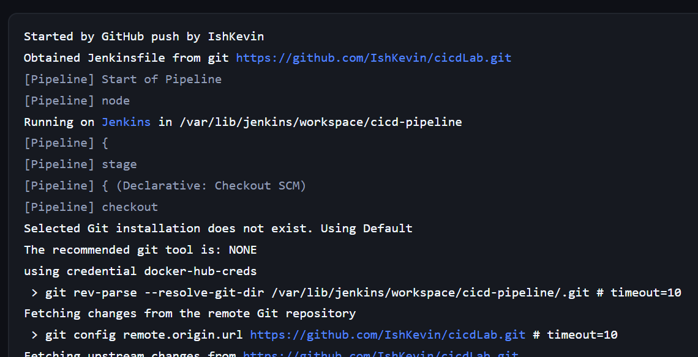
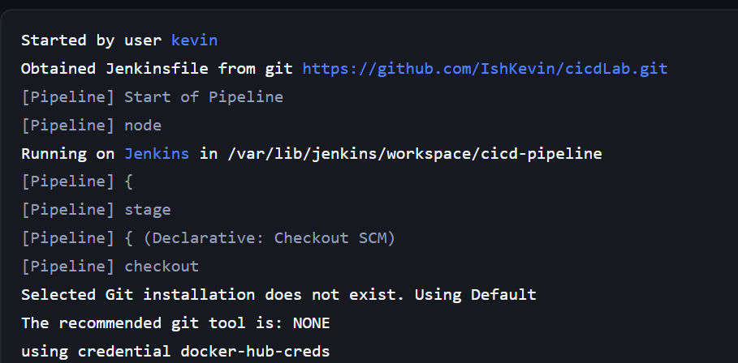

# CI/CD Pipeline for Flask Application

This project implements a fully automated CI/CD pipeline for a Flask web application using Jenkins, Docker, GitHub Webhooks, and AWS EC2.

The pipeline automatically builds, tests, pushes, and deploys the application whenever code is pushed to GitHub.

---

# Architecture

- Jenkins Server (CI/CD automation)
- EC2 Application Server (Docker runtime)
- GitHub (source code + webhook trigger)
- Docker Hub (image registry)

---

# CI/CD Pipeline Flow

1. Code pushed to GitHub
2. GitHub webhook triggers Jenkins
3. Jenkins executes pipeline:
   - Install dependencies
   - Run tests
   - Build Docker image
   - Push image to Docker Hub
   - SSH into EC2 server
   - Deploy updated container
4. Application is updated automatically

---

#  Pipeline Evidence

## 1. Jenkins Build Success

This confirms:
- Code checkout
- Dependency installation
- Tests executed successfully



---

## 2. Docker Build & Push Success

This confirms:
- Docker image was built successfully
- Image pushed to Docker Hub



---

## 3. GitHub Webhook Trigger Success

This confirms:
- Jenkins pipeline was triggered automatically from GitHub push event



---

## 4. Full Pipeline Execution (End-to-End)

This shows the complete CI/CD flow working together:
GitHub → Jenkins → Build → Test → Docker → Deploy



---

# Application Access

After successful deployment, the application runs on EC2:

```

http://<EC2_APP_IP>:5000

````

---

# Technologies Used

- Jenkins
- Docker
- GitHub Webhooks
- AWS EC2
- SSH
- Flask

---

#  Key Features

- Fully automated CI/CD pipeline
- Dockerized deployment
- Webhook-based trigger (no manual builds)
- Remote deployment via SSH
- Production-like workflow

---

#  Cleanup

```bash
cd terraform
terraform destroy -auto-approve
````

---

# Author

Kevin ISHIMWE
